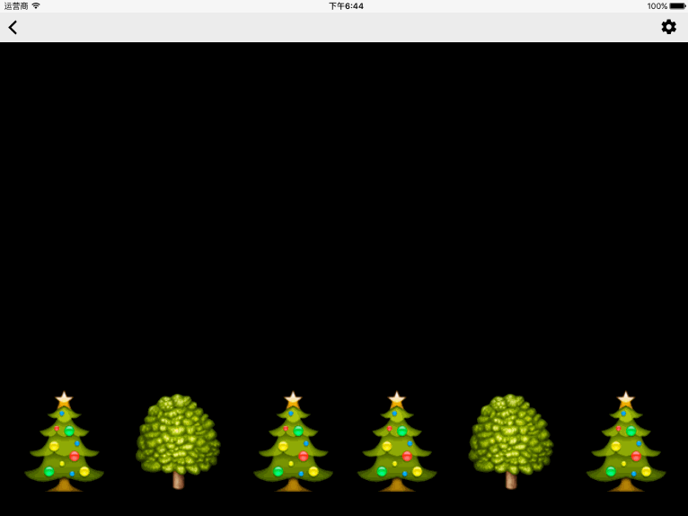
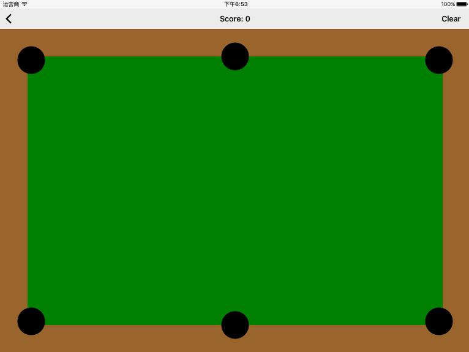
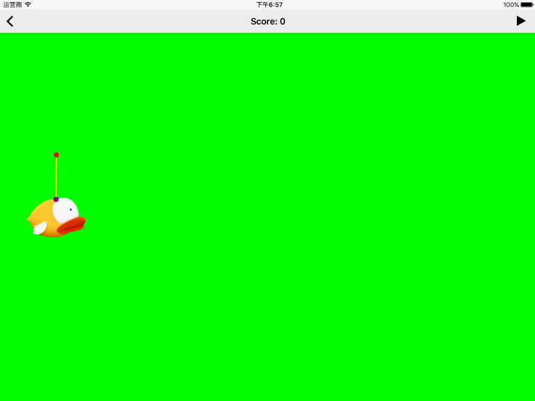

#DynamicAnimationExample

DynamicAnimationExample is a quite vivid and interesting  example to show the usage of 
dynamic animation.

####GravityBehavior and PushBehavior

 

####CollisionBehavior

 

####AttachmentBehavior

 

## License
DynamicAnimationExample is released under the MIT license. See [LICENSE](https://github.com/hongxinhope/DynamicAnimationExample/blob/master/LICENSE.md) for details.
